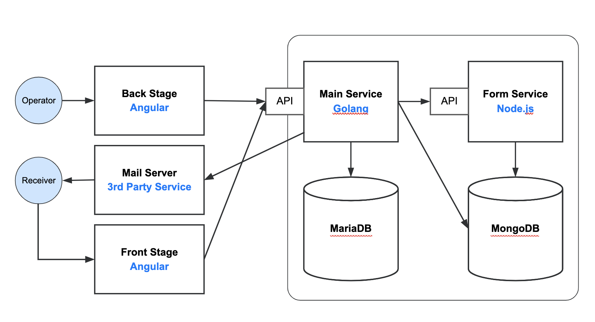

# {{ $frontmatter.title }}

:::info Intro
{{ $frontmatter.description }}
:::

## 系統架構

要從無到有將系統建起來，首先需要了解系統的架構。廢話不多說，先上圖。

這個系統是長成這個鬼樣子的，至於為什麼要用這麼多種語言設計，不要問我，去問前人。總之這系統上的各套服務，原本是架在不同 Server 的，而我這次要做的事情就是將它們全部搬到同個 Server 運行。

經過一陣子的研究後，要達成目標，需要下列技術：

1. Linux 基本操作
1. 資料庫安裝（MariaDB & MongoDB）
1. Node.js build & deploy
1. Golang build & deploy
1. Angular build & deploy
1. Service config（systemd）
1. Web Server config（httpd）

> 補充一下困難程度，在開始做這件事前，我會的只有 5 而已…

## 資料庫建置

好！那麼首先要嘗試的，就是資料庫的安裝。

由於對這兩套資料庫完全不了解，我先在本機（Mac）試著用 homebrew 安裝了幾次。現在回過頭看覺得挺好笑的，因為後來才知道在 Mac 安裝跟在 Linux 安裝，完全是兩回事…

### MariaDB

MacOS 安裝：https://mariadb.com/kb/en/installing-mariadb-on-macos-using-homebrew/
Linux 安裝：https://blog.gtwang.org/linux/centos-7-install-mariadb-mysql-server-tutorial/

### MongoDB

MacOS 安裝：https://docs.mongodb.com/manual/tutorial/install-mongodb-on-os-x/
Linux 安裝：https://docs.mongodb.com/manual/tutorial/install-mongodb-on-red-hat/

> 目標伺服器是 Linux CentOS 7，也是因此契機才稍微去瞭解了下 Linux 作業系統，才知道原來有非常多版本。有興趣知道更多可參考這篇：[黑暗執行緒 - 我的 Linux 作業系統考察](https://blog.darkthread.net/blog/linux-server-os-survey/)

安裝了資料庫後才是真正的開始，會遇到 root 密碼無法登入問題、安全性設定問題等怪事，這部分就不細說了，總之 Stack Overflow 是你我的好朋友。

## Node.js 專案部署

完成資料庫的安裝後，接著是 Form Service，因為這套要先運行起來，Main Service 才能運行。由於在前端打滾了一年，多少還是懂一點 NPM，因此只要稍微讀一下 Package.json，就大概知道操作指令有哪些了。

接著，做下面這些事情：

- 將專案資料夾複製到伺服器的專案路徑下
- 建立服務的設定檔（`/lib/systemd/system/.service`）
- 在專案路徑執行 `npm install` 以下載依賴套件
- 啟動服務：`systemctl start <service_name>.service`
- 檢查服務：`systemctl status <service_name>.service`
- 開放 tcp 連線 port：`firewall-cmd --add-port=<port_number>/tcp`

> 在服務設定檔中會指定專案路徑，以及在這個路徑底下要 Linux 執行什麼指令，因此熟悉的 `npm run start` 就會寫在這裡。

## Golang 專案部署

在測試過 `Form Service` 正常運行後，就可以來接著架 `Main Service` 了。由於我完全不會 Golang，因此花了一些時間從頭學習，也整理出幾個 Go 常用的套件，找了一些 tutorial 來做。

Golang 常用套件：

- `Gin`：http server
- `Gorm`：MariaDB 操作
- `Mongo`：MongoDB 操作
- `Cron`：排程設定
- `Cobra`：指令處理
- `Jwt`：認證處理

熟悉了基本的結構後，就可以試著來 Build Project 了。在打包 Golang 成應用程式時，必須要注意要運行的環境規格（`GOOS`、`GOARCH`）。

接著，做下面這些事情：

- 將專案資料夾複製到伺服器的專案路徑下
- 建立服務的設定檔（`/lib/systemd/system/.service`）
- 啟動服務：`systemctl start <service_name>.service`
- 檢查服務：`systemctl status <service_name>.service`
- 開放 tcp 連線 port：`firewall-cmd --add-port=<port_number>/tcp`

因為 `Main Service` 需要接收 http request，因此 tcp 一定要確認好。

## Angular 專案部署

資料庫跟前面兩套系統 run 起來之後，終於來到熟悉的 Angular 專案部署。因為很常做，這裡就不廢話，按照 Package.json 裡的說明 Build，然後複製到伺服器的專案路徑資料夾即可。

有一點可以延伸討論，前人有為這個專案留下 Shell Script 部署檔，讓打包部署流程變得方便許多，這次在仔細研讀後，也對整個流程到底是做了哪些事情有進一步的認識。或許之後也可以寫一些 Shell Script 小工具。

## Linux 設定

在部署上面前後端程式及資料庫的過程中，一直有碰到陌生的未知領域，在查找了好一陣子之後，整理出下面三塊 Linux 設定。

### Service

通常後端服務都會作為 Service 運行，而在 Linux 想要運行服務，很常會用到的一些基本指令（也是我在這次架站過程中反覆用到的指令），整理如下：

- Lsof：
  - 查詢目前使用中的 port 及 process id：`lsof -n -i`
  - 查詢特定 port 的服務：`lsof -n -i:<port_number>`
  - 清除 `PID：kill <PID>`
- Systemctl：
  - 查看所有服務狀態：`systemctl --type=service`
  - 查看特定服務狀態：`systemctl status <service name>`
  - 啟動服務：`systemctl start <service name>`
  - 停止服務：`systemctl stop <service name>`
  - 重啟服務：`systemctl restart <service name>`
  - 查看服務的設定檔：`systemctl cat <service name>`

### Firewall

後端服務 run 起來時我也稍微卡了一下，因為從 local 明明就可以打到 API，不知為何換個 ip 就一直失敗。後來查到原來是防火牆沒設定好，真相往往就這麼簡單。

常用指令：

- 列出使用中的 port：`firewall-cmd --list-ports`
- 打開 port：`firewall-cmd --add-port=<port_number>/tcp`
- 永久打開 port：`firewall-cmd --permanent --add-port=<port_number>/tcp`
- 重啟：`firewall-cmd --reload`
- 關閉 port：`firewall-cmd --remove-port=<port_number>/tcp`

> 其實除了預設的 80 Port 外，應盡量少讓其他人可以透過 tcp 直接連進伺服器會比較好，這部分的知識我尚未具備，還需要深入精進。

### Web Server

這裡也是卡很久，但其實若對 httpd 有些了解，應該是很簡單的事，因為就是 Directory 跟 Proxy Reverse 兩件事而已。

> 其實應該還缺 SSL 憑證相關的東西，但因為這次沒有接觸到設定網域名稱，之後有碰到再說吧！目前遇到的都還不是非常難的問題，一樣是那句話，凡事問 Stack Overflow 就有解了 XD（例如說 Apache config 檔案在哪… [Where is the Apache configuration in CentOS](https://www.liquidweb.com/blog/apache-configuration-centos/)）

## 結論

從研究各套 code 到嘗試建置的過程，前後加起來共 2 週，對一個 Senior 來說可能嫌太久（或許 Senior 只需要 3 天？），但我給自己一個正面的肯定。經過這次的磨練，補強知識的同時也在訓練自學能力，覺得能解這次任務實在是太好了！
