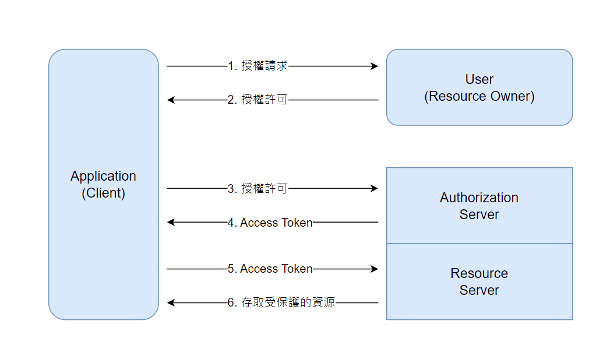
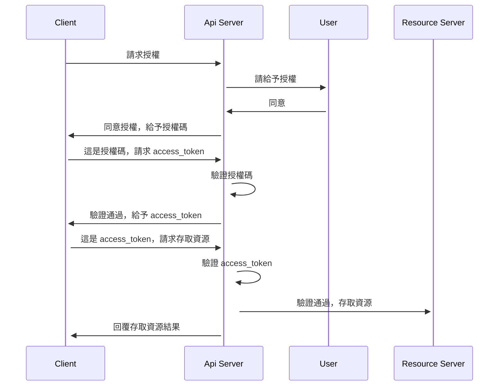

# {{ $frontmatter.title }}

:::info Intro
{{ $frontmatter.description }}
:::

## OAuth 2.0

> [An Introduction to OAuth 2](https://www.digitalocean.com/community/tutorials/an-introduction-to-oauth-2)

說到身分認證與存取權限策略，業界現行的普遍標準就是 OAuth 2.0。

OAuth 2.0 是一個授權框架，他讓應用程式能夠獲得用戶在 HTTP 服務上的資源的存取許可權。

它的工作原理是將用戶身分驗證委託給託管用戶帳戶的服務（例如 Google、Facebook、Github...等），並授權給第三方應用程式訪問該用戶的帳戶，意即讓某個 APP 能夠存取你的 Google Drive 資料夾。

### OAuth 角色

OAuth 定義了四個角色：

- Resource Owner 資源擁有者：資源擁有者是授權應用程式訪問其帳戶的使用者。應用程式對使用者帳戶的訪問僅限於授予的授權範圍（例如讀取或寫入存取權限）。
- Client：Client 是想要存取使用者帳戶的應用程式。在執行此操作之前，它必須由使用者授權，並且授權必須由 API 驗證。
- Resource Server：託管用戶的受保護資源的伺服器。
- Authorization Server：授權伺服器驗證使用者的身份，然後向應用程式頒發訪問令牌。

通常軟體開發者將 Authorization Server 與 Resource Server 綁定在一起，作為 API server。

### 抽象協定流程

以下這張圖描述 OAuth 角色間如何交互：

1. 應用程式向用戶請求訪問受保護資源的授權
2. 用戶同意授權，應用程式得到授權許可
3. 應用程式向授權伺服器（API）請求訪問令牌
4. 如果授權有效，則授權伺服器（API）頒發訪問令牌
5. 應用程式向資源伺服器（API）請求資源，並提供訪問令牌進行身分驗證
6. 如果訪問令牌有效，則資源伺服器（API）提供資源

流程如下：

這是基本思路，實際上流程會隨著不同情境而有不同應用。

通常應用程式 Client 會需要向服務註冊，並帶著 Client ID 與 Client Secret 向服務表明自己的合法性。

### 授權授予

OAuth 定義了三種主要的授權類型，適用於不同場景：

- Authorization Code 授權碼：用於伺服器端應用程式
- Client Credentials 用戶端憑證：用於具有 API 存取權限的應用程式
- Device Code 設備代碼：用於缺少瀏覽器或有輸入限制的設備

以下僅提最常使用的 Authorization Code 授權碼。

授權碼授權類型是基於重新定向的流程，這表示應用程式必須能與使用者代理（即使用者的瀏覽器）交互，並接收通過使用者代理路由的 API 授權碼。

以下這張圖描述 Authorization Code 授權碼交互：

1. 向使用者提供一個授權代碼連結，包含一些資訊如：
   - `client_id`：應用程式 Client ID，讓 API 服務識別用
   - `redirect_uri`：得到授權碼後，服務會將用戶重新定向的連結
   - `response_type`：指定授權類型為授權碼（Authorization Code），通常值為 `code`
   - `scope`：請求授權的範圍
2. 使用者授權給應用程式
   - 常見的畫面如 Google 詢問是否同意授權給某某應用程式存取你的帳號資料等等，有時需要重新登入
3. 使用者代理重新定向到 redirect_uri，將授權碼發送給應用程式
4. 應用程式使用授權碼請求 `access_token`
5. 應用程式接收 `access_token`

直接取得一個 `access_token` 有時並不一定足夠安全。這是因為訪問令牌是 bearer 類型，意味著任何持有該令牌的人都可以使用它。一但你的 `access_token` 在網路上遭到洩漏或被截取，任何人都可以拿著它存取你的受保護資源。

我們當然不想要這樣吧！

因此延伸出了一種相對安全的作法：令牌時效性。

### Refresh Token Grant

這是 OAuth 2.0 定義的一種標準授權給予類型。

運作原理如下：

1. 當用戶第一次授權應用程式時，授權服務會頒發一個 `access_token` 及一個 `refresh_token`
   - `access_token` 通常是短期有效的（例如 5 分鐘過期），用於訪問受保護的資源
   - `refresh_token` 通常是長期有效的（例如 1 個月），用於獲取新的 `access_token`
1. 當 `access_token` 過期時，API 服務會返回 401 錯誤碼，拒絕存取資源
1. 用戶端可以向授權服務請求新的 `access_token`，不需要用戶再次給予授權。換句話說，不需要一直重複登入或點「同意許可」啦！
1. 當 `refresh_token` 過期時，還是需要用戶重新給予授權

`access_token` 的短期有效性能夠讓令牌洩漏的風險有效降低。即使其他人拿到這個令牌，也有很大機會是失效的。

因此保管 `refresh_token` 就成為一個重要的議題。

下面是一些建議作法：

- 儲存在服務端
- 使用 HttpOnly Cookie 儲存在客戶端，避免被使用 JavaScript 存取
- 對 `refresh_token` 加密或簽名
- 刷新 `access_token` 時，除了 `refresh_token` 之外，還需要 `client_secret`

透過這些作法，至少能提高一些安全性，對一般的服務而言算很夠用了。

據說坊間有服務是把用戶的密碼存明碼在資料庫的，這種希望只是都市傳說，千萬別是真的吧。

## 參考資料

- [An Introduction to OAuth 2](https://www.digitalocean.com/community/tutorials/an-introduction-to-oauth-2)
