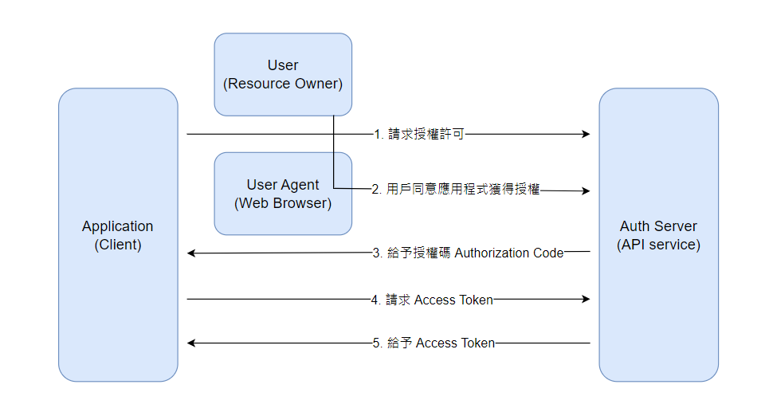

# {{ $frontmatter.title }}

:::info Intro
{{ $frontmatter.description }}
:::

## PKCE（Proof Key for Code Exchange）

> 這是一種用於增強 OAuth 2.0 授權碼模式安全性的機制，特別針對公共用戶端設計。它的主要目的是防止授權碼被截取和濫用。
>
> 它被定義在 [RFC7636](https://datatracker.ietf.org/doc/html/rfc7636) 這個標準裡。

### 要解決什麼問題？

這是比較進階的安全性防範情境了，不過也不代表不會遇到。

在 Authorization Code Grant 這個普遍的授權機制中，Client 需要拿授權碼向 Auth Server 取得 `access_token`，再用 `access_token` 向資源伺服器取得受保護的資源。

:::danger
萬一在交換過程中授權碼洩漏或被截取，第三方的惡意程式就可以取得 `access_token`，這個情景是我們不想遇到的。
:::

如果這一段是被隱藏在有後端服務的 Client 端，是比較安全的，因為可以安全地保護 client_credential，多一層保障。但如果客戶端是 Public Client，情況就不同了。

公開客戶端（如 SPA）無法安全地儲存 credential 或 secret 等資訊，Auth Server 無法驗證請求 `access_token` 的這一方是否是受信任的請求方。

### 解決方案

既然 Auth Server 無法驗證請求方是受信任的請求方，那就把思維翻轉過來，讓「請求方自驗」。

這是什麼意思呢？

再看一次 Authorization Code 授權碼流程：

我們發現脆弱的部份在於步驟 (3) 與 (4) 之間，Auth Server 無法確定這是來自同一個客戶端的請求。

既然客戶端無法安全地保存固定的 credential 資訊，那很簡單，只要在每次步驟 (1) 之前，動態生成一段 secret，並將 secret 加密之後發送給 Auth Server，Auth Server 在簽發授權碼的時候會將授權碼與這段加密後的 secret 配對起來，之後不論請求 `access_token` 的請求方是誰，它必須要提供這段 secret 來讓 Auth Server 驗證是否為同一人。

這方法簡單卻又聰明，等於客戶端保有一段只有自己知道的密碼，事先告訴你驗證結果，等到要驗證的時候再拿出這把鑰匙。

如此就算加密過的 secret 被竊取或授權碼被截取，第三方惡意程式在請求 `access_token` 的時候，都會因為沒有提供正確的 secret 而被拒絕了。

那麼，接下來就來看看它是怎麼運作的吧。

### 運作流程

1. 客戶端生成 `code_verifier`：用戶端發起授權之前，首先生成一個 43~128 之間，以字母、數字、特定符號組成的隨機字符串
1. 生成 `code_challenge`：用戶端將 `code_verifier` 通過 SHA-256 算法進行雜湊，將結果 base64 編碼，生成 `code_challange`
1. 發送授權請求：用戶端向授權伺服器發送授權請求，包含以下參數：
   - `response_type`：通常設置為 `code`，表示請求授權碼
   - `client_id`：應用程式的客戶端 ID
   - `redirect_uri`：用於接收授權碼的 URI
   - `scope`：請求的權限範圍，例如用戶的基本資料
   - `state`：防止 CSRF 攻擊的隨機字符串
   - `code_challenge`
   - `code_challenge_method`：通常為 `S256`
1. 用戶授權：用戶在授權伺服器上進行身分驗證並授權，授權伺服器將授權碼發送回用戶端指定的重新定向 URI
1. 請求 `access_token`：用戶端使用收到的授權碼向授權伺服器請求訪問令牌，在這個請求中，用戶端需要提供：
   - `client_id`
   - `grant_type`：設置為 `authorization_code`，表示使用授權碼許可
   - `code`：上一步獲得的授權碼
   - `redirect_uri`：與授權請求中使用的 URI 相同
   - `code_verifier`（最初生成的密碼）
1. 驗證和發放令牌：授權伺服器收到請求後，會驗證提供的 `code_verifier` 是否與最初的 `code_challenge` 匹配，若匹配則發放訪問令牌
